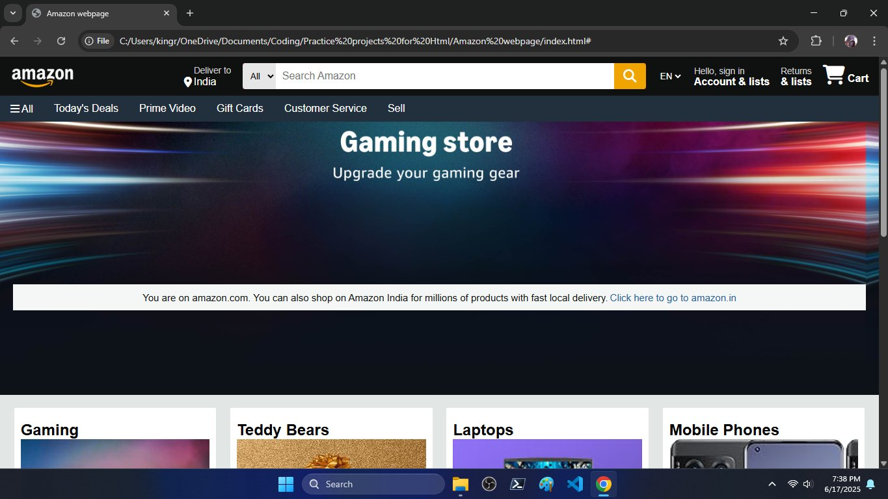

# 🛒 Amazon Clone - HTML & CSS Project

This is a **Day 4** project of my `#100DaysOfCode` challenge — a clone of the Amazon homepage created using just **HTML** and **CSS**. It helped me understand layout design, responsive structure, and styling real-world UI elements.

## 🔍 Features

- Amazon-like homepage layout
- Navigation bar with dropdown-like structure
- Search bar UI
- Product sections (Gaming, Laptops, Mobiles, etc.)
- Basic responsive behavior using flexbox

## 📸 Screenshot



## 🛠️ Built With

- HTML5
- CSS3

## 📁 Folder Structure

```plaintext
main/
│
├── index.html
├── style.css
├── all images in main
└── README.md
